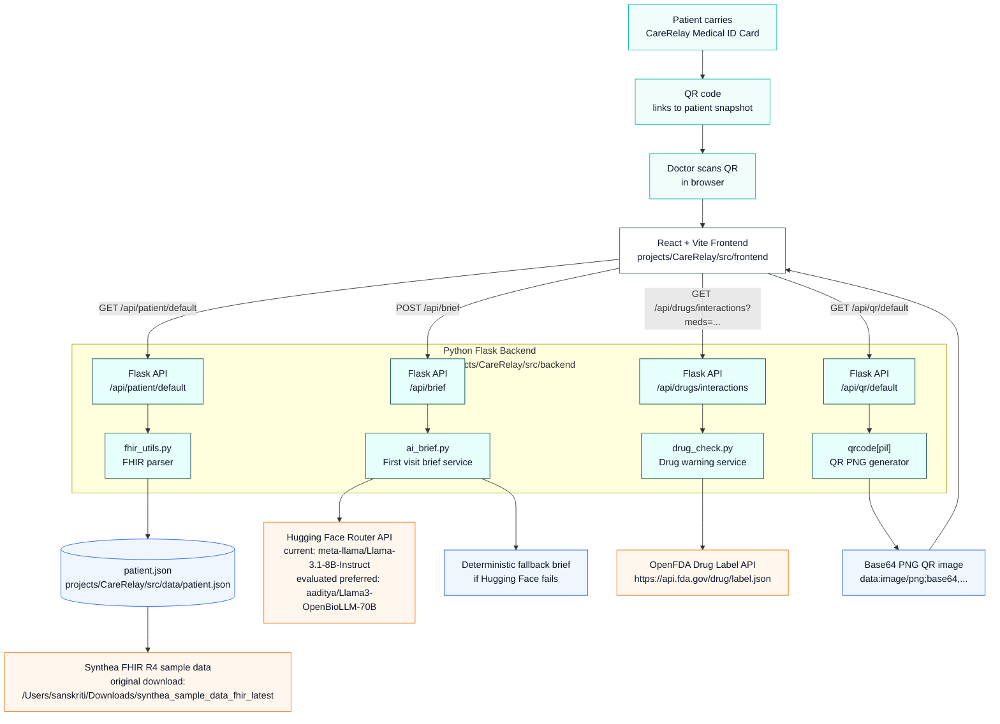

# CareRelay Architecture

## Data Sources

| Source | Used For | Location / Endpoint |
|---|---|---|
| Synthea FHIR R4 | Synthetic patient demographics, conditions, medications, labs, encounters, timeline | `projects/CareRelay/src/data/patient.json` |
| OpenFDA Drug Label API | Medication warning and interaction label text | `https://api.fda.gov/drug/label.json` |
| Hugging Face Router API | First-visit brief generation | `meta-llama/Llama-3.1-8B-Instruct` |
| Local QR generator | Patient ID card QR image | Flask `qrcode[pil]`, returned as base64 PNG |

## Notes

- No real patient data or PHI is used.
- OpenBioLLM (`aaditya/Llama3-OpenBioLLM-70B`) was evaluated as the preferred clinical model, but provider availability varied during testing.
- Drug warnings use OpenFDA label data instead of LLM-only reasoning.
- The QR code points to the frontend patient snapshot URL for the demo.
